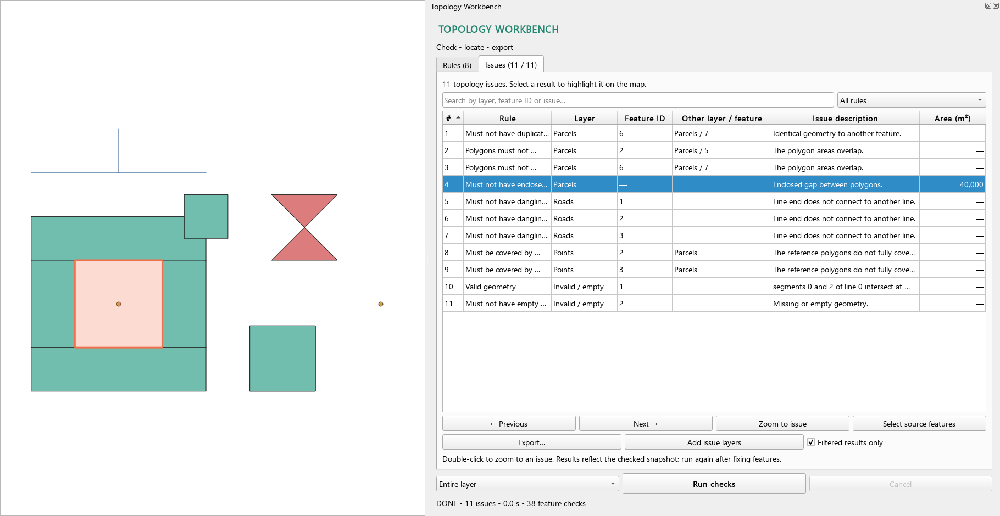
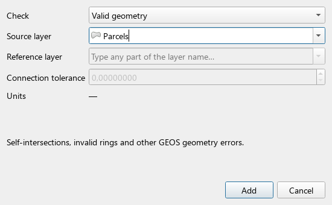

# Topology Workbench for QGIS

Searchable layer selection, background topology checks and exportable results for QGIS **3.44+ and 4.x**. The interface automatically follows QGIS: **English in English QGIS, Hungarian in Hungarian QGIS**, with English as the fallback for other languages.

[Download the latest release](https://github.com/danzig666/qgis-topology-workbench/releases/latest) · [Magyar dokumentáció](docs/README.hu.md) · [Report an issue](https://github.com/danzig666/qgis-topology-workbench/issues)



The screenshot shows the actual Qt plugin widgets and a QGIS map canvas with the included synthetic demo data.

## Install

1. Download **`topology_workbench-1.2.0.zip`** from the [release page](https://github.com/danzig666/qgis-topology-workbench/releases/latest).
2. In QGIS, open **Plugins → Manage and Install Plugins → Install from ZIP** and select that file.
3. Enable **Topology Workbench** and open it from its toolbar icon or **Vector → Topology Workbench**.

No external Python packages are needed. Tested with **QGIS 3.44.9 / Qt5** and **QGIS 4.2.2 / Qt6**, in both English and Hungarian. Future QGIS API changes may require additional validation.

## Work with rules and issues

- **Searchable layer lookup:** type any part of a layer name and choose a matching layer. The source selector filters by the geometry types supported by the rule; polygon reference layers are also searchable.
- **Basic checks:** add validity, empty-geometry and duplicate checks for the active layer, plus overlap checks for polygons. Repeated clicks do not duplicate existing rules.
- **Saved rule sets:** rules are stored in the QGIS project; save the project to persist them. Export and load JSON rule sets for reuse. Loading JSON replaces the current rule list. Missing layers are reconnected by unique name, or assigned manually with **Edit** when missing or ambiguous.
- **Check scope:** entire layers, selected source features or features intersecting the current map extent. Comparisons still use surrounding and reference features, avoiding artificial dangles and missing overlap pairs. Selection mode requires selected features in every enabled source layer.
- **Results:** search across rule names, layers, feature IDs and messages; filter by rule and sort columns. Select results to highlight them, double-click to zoom, navigate to the previous or next result, or select the corresponding source and comparison features.
- **Export:** CSV, GeoPackage or temporary QGIS issue layers. **Filtered results only** controls whether export/layer creation uses the visible results or the complete issue list.
- **After editing:** results reflect the checked snapshot. Changes to rules or relevant feature geometries mark existing results as stale. Run the checks again after making fixes.



## Nine checks

| Rule | Behavior |
| --- | --- |
| Valid geometry | GEOS validity, including self-intersections and invalid rings. Uses a specific error location when QGIS supplies one. Empty geometries have a separate check. |
| Must not have empty geometry | Missing or empty geometries; some cannot be located on the map. |
| Single-part features only | Flags geometries containing multiple actual parts. A multipart type containing one part is allowed. |
| Must not have duplicate geometry | Spatially identical geometries, including different vertex order. Attributes are not compared. |
| Polygons must not overlap | All overlaps with positive area, including containment and identical polygons. Shared boundaries are allowed. |
| Must not have enclosed gaps | Enclosed holes in the union of the entire polygon layer. Intentional polygon holes are also flagged. Does not find gaps open to the outer boundary or infer a coverage boundary. |
| Must not have dangling line ends | Line ends must connect to another line or another part of the same feature. T-junctions into a line interior and closed lines are allowed. |
| Must be covered by reference polygons | Point, line or polygon geometry must be fully covered by the union of reference polygons. Boundaries are allowed; the uncovered part is returned. |
| Must not overlap the reference layer | Overlaps with positive area between two separate polygon layers. |

Connection tolerance is in the **source layer CRS units**, including degrees for geographic CRS. Polygon overlaps have no area threshold, so small positive-area slivers are included. Reference geometries in another CRS are transformed into the source CRS. Spatial checks use planar GEOS operations; Z/M do not determine connectivity and curves are segmentized for comparison.

## Language behavior

The plugin selects its language when it starts, using the active QGIS interface translation before the general locale used for number formatting. Hungarian language codes such as `hu` and `hu_HU` select Hungarian; English and unsupported languages use English.

Controls, rule titles/descriptions, plugin validation errors, status messages and generated export messages follow the selected language. User-supplied layer names, IDs, JSON keys and export column names stay unchanged, allowing rule sets to be shared across languages. Native diagnostics from QGIS/GEOS are returned by those libraries. Restart QGIS after changing its interface language.

## Exports and run limits

**CSV:** UTF-8 with BOM, semicolon-delimited and quoted for Excel. Includes rule/layer IDs and names, source and comparison feature IDs, issue messages, original CRS/WKT, run scope, UTC start time, completion/stale flags and warnings. Text values that could be interpreted as spreadsheet formulas are prefixed with an apostrophe.

**GeoPackage:** map geometries use the current map CRS, with separate point, line, polygon and nonspatial tables. The original issue geometry remains in the WKT/CRS attributes. Exported map geometries are 2D and segmentized. Mixed geometry collections may produce multiple rows/tables with the same `error_id`. The destination is replaced only after a complete temporary export succeeds; errors preserve an existing destination. Export to a new filename if the destination is open as a project layer.

**Temporary issue layers** are memory layers; export them to GeoPackage for permanent storage.

**Gap size:** enclosed gaps have an **Area (m²)** column; click its header to sort numerically and find the largest gaps. Projected layers use planar area in their source CRS, converted to square metres (including feet). Geographic layers use ellipsoidal area on the source CRS ellipsoid. This is independent of the current map CRS and project measurement settings. CSV, GeoPackage and temporary issue layers preserve the numeric value as `area_m2`, even when exporting geometries to another CRS. Other issue types leave this field empty. Very small gaps remain visible using significant digits.

Checks run as cancellable QGIS tasks, using owned feature-source snapshots captured on the main thread and spatial indexes for comparisons. The worker does not access live layers, the project or UI widgets. It reads the entire comparison context, even for selected-feature checks.

The default limit is **10,000 issues**, adjustable to **100,000**. Up to **250,000 features per layer** can be read. Reaching a limit, cancellation, failed transforms or skipped invalid geometry produces visibly **incomplete results**, also recorded in exports. Cancellation takes effect after an ongoing GEOS operation finishes. Geometry repairs are performed with QGIS editing tools.

## Try the demo

Download and extract **`topology_workbench-demo-1.2.0.zip`** from the release, or use the files in [`examples`](examples). Open `topology-demo.qgz` with `topology-demo.gpkg` beside it. Eight saved rules find **11 intentionally introduced issues**: duplicates, overlaps, an enclosed gap, dangling ends, coverage errors, a self-intersection and an empty geometry. The layer names are English; the plugin UI still follows your QGIS language.

## Development and verification

Use QGIS's Python runtime for the integration tests:

```powershell
.\tools\run_tests.ps1 -QgisRoot 'C:\Program Files\QGIS 3.44.9'
.\tools\run_tests.ps1 -QgisRoot 'C:\Program Files\QGIS 4.2.2'
python .\tools\audit_translations.py
python .\tools\package_plugin.py
```

The PowerShell runner tests both languages by default; use `-Language en_US` or `-Language hu_HU` for one. On Linux/macOS, run `tests/test_qgis.py` using a configured PyQGIS Python environment and set `TOPOLOGY_TEST_LANGUAGE` to the language to test.

The **48 integration tests** exercise real PyQGIS/GEOS operations, background tasks, widgets, locale detection, translation coverage, placeholder preservation, exports and translator cleanup. They pass for both languages on both tested QGIS versions (**192 test executions**). Run `tools/verify_package.py` with QGIS's Python to load the packaged ZIP through QGIS's real plugin loader in an isolated directory. The same `TOPOLOGY_TEST_LANGUAGE` variable controls package-language verification.

`tools/build_demo.py` regenerates the sample project and actual widget screenshots using QGIS's Python. `tools/package_plugin.py` creates deterministic install/demo ZIPs with SHA-256 checksums using ordinary Python. The GitHub build workflow performs source/translation audits and creates packages; QGIS integration testing is a separate runtime check, not claimed by the package-build workflow.

To update translations, edit English source strings and [`topology_workbench/i18n/hu.json`](topology_workbench/i18n/hu.json). Keep positional placeholders and format specifications identical in both languages. The catalog is loaded through a plugin-specific Qt translator, so no Qt Linguist compiler is needed.

Implementation references: [QGIS tasks](https://docs.qgis.org/3.44/en/docs/pyqgis_developer_cookbook/tasks.html), [application language API](https://api.qgis.org/api/classQgsApplication.html), [layer selector](https://api.qgis.org/api/classQgsMapLayerComboBox.html), [geometry API](https://api.qgis.org/api/classQgsGeometry.html), [vector writer](https://api.qgis.org/api/classQgsVectorFileWriter.html).

Licensed under **GNU GPL 3.0 or later**; see [LICENSE](LICENSE).
